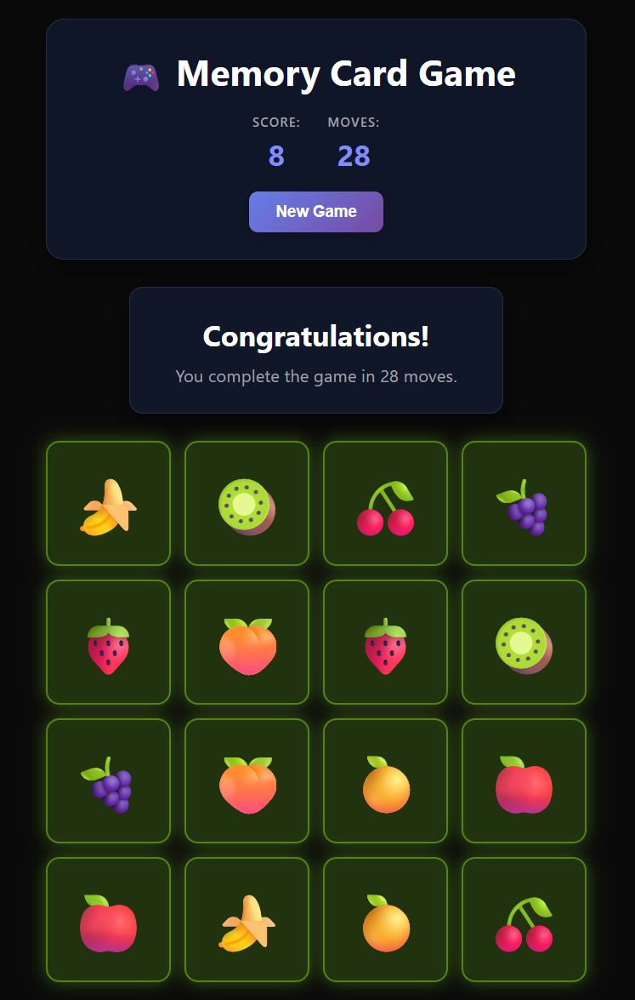

# Memory Card Game

React JS + Vite app from the youtube video :

- [Yt Pedrotech channel](https://www.youtube.com/@PedroTechnologies)
- [Build 3 React Projects in 4 Hours | ReactJS Course For Beginners](https://www.youtube.com/watch?v=r47C9c4qCqE)

Obs: This is the first app

## Topics

<ul>
<li>Hooks (useState,useEffect)
<li>Custom hook (useGameLogic)
<li>Components
</ul>

## Further research

Calling setState synchronously within an effect body causes cascading renders that can hurt performance, and is not recommended.

[React dev link](https://react.dev/learn/you-might-not-need-an-effect).
